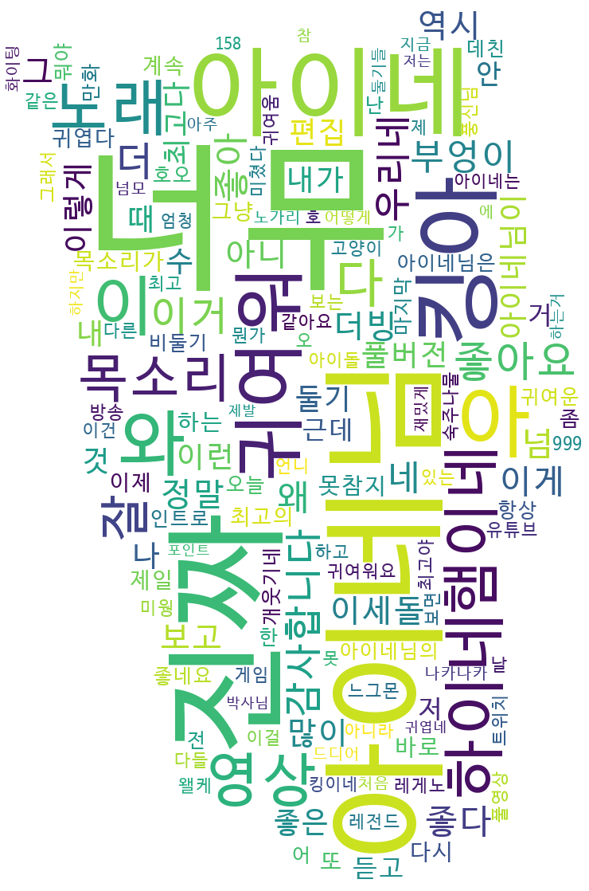

# INE_comment_analysis
 아이네 유튜브 댓글 분석

 버츄얼 스트리머 [아이네]님의 유튜브 영상들 댓글을 wordcloud와 word2vec으로 간단히 분석해봅니다.

# 데이터 수집
 [GCP youtube api]를 사용해 유튜브 댓글을 수집합니다.

# 전처리 방법
 ## 링크 제거 및 오타 교정
  댓글 내에 url, 자음 및 영어 등의 쓸데없는 문자를 제거합니다.  
  또한 계속해서 반복되는 단어도 제거합니다.
  > 3:00 비둘기 소리 내시는 리액션인 줄 ㅋㅋㅋㅋㅋ  
  > -> 비둘기 소리 내시는 리액션인 줄

  > 우리네! 우리네! 우리네! 우리네! 우리네! 우리네!  
  > -> 우리네

 ## ~~맞춤법 및 틀린 글자 교정~~
  **이 방법은 현재 사용하지 않고 있습니다.**  
  [py-hanspell]을 사용해 맞춤법을 교정합니다. 잘못 교정된 단어는 수정으로 다시 원상복구합니다.
  > 궁금했던겄들 알려주셔서 감사해요  
  > -> 궁금했던 것들 알려주셔서 감사해요	

 ## 형태소 분석 및 필터링, 동사 원형 복구
  [Khaiii]를 이용해 형태소 분석을 진행하고, 쓸데없는 단어는 제거하고 동사 원형을 복구합니다.
  > 영상을 더 잘 이해할 수 있게 되어서 너무 좋습니다 킹아	  
  > -> 영상 더 잘 이해하다 있다 되다 너무 좋다 킹아

# wordcloud
 

# word2vec
 [이곳]에서 결과물을 시각화해 확인할 수 있습니다. 단, 현재는 데이터가 적기 때문에 유효하지 않은 결과가 많은 편입니다.

[아이네]: https://www.twitch.tv/vo_ine
[GCP youtube api]: https://developers.google.com/youtube/v3/getting-started?hl=ko
[py-hanspell]: https://github.com/ssut/py-hanspell
[Khaiii]: https://github.com/kakao/khaiii
[이곳]: https://projector.tensorflow.org/?config=https://raw.githubusercontent.com/Nam-SW/INE_comment_analysis/main/resource/projector_config.json
